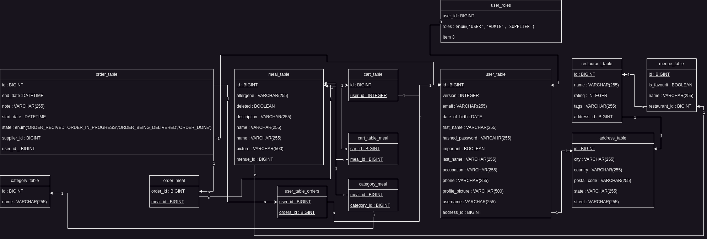

# MealMate

> MealMate erleichter den Bestellprozess für Benutzer und Restaurantbesitzer. Mit dieser Applikation können Restaurants ihre Speisekarte erstellen und bearbeiten und dem Kund:innen zur verfügungsellen. Die Benutzer:innen können wiederum aus den Speisekarten auswählen und Bestellungen an das Restaurant übermitteln.

## Hardware-Voraussetzungen
- Betriebssystem mit installierter Java Umgebung
  - Windows 10/11
  - MAC OS 10.0.4 oder neuer
  - Linux
- JDK 17 oder höher

## Inbetriebnahme des Vaadin-Server 
```bash
git clone https://github.com/SWE2-Group-2/MealMate.git
cd MealMate
mvn clean install
java -jar /target/MealMate.jar
```

## Aufbau der Datenbank

